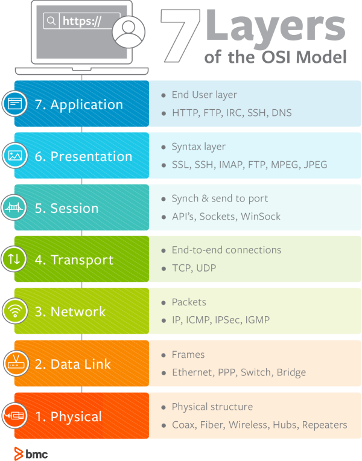
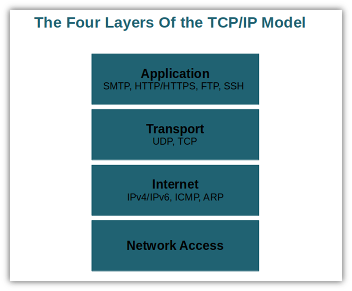
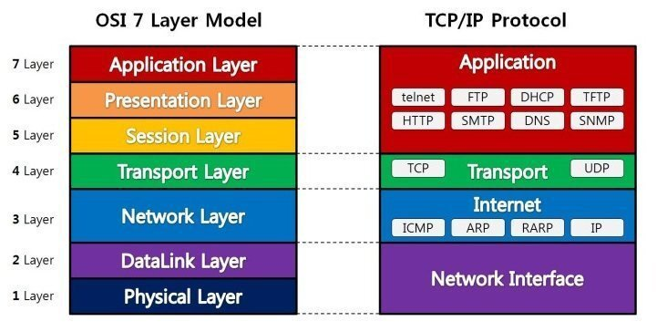

# OSI 7계층과 TCP/IP 4계층

눈에 보이지 않는 네트워크 통신 과정을 구조적으로 계층화한 것이 네트워크 계층 구조이다. 즉, 통신이 일어나는 과정을 단계별로 표현한 것이라고 할 수 있다.

대표적인 네트워크 계층 구조로는 OSI 7계층과 TCP/IP 4계층이 있다.

## OSI 7계층

### 응용 계층(Application)

- 사용자가 네트워크에 접근할 수 있도록 인터페이스를 제공하는 계층
- 사용자와 가장 밀접하게 연결되어 직접적으로 보이는 제 7계층
- HTTP, SMTP, FTP, SSH, DNS 프로토콜이 해당 계층에서 사용된다.

> SMTP(Simple Mail Transfer Protocol)   네트워크를 통해 전자우편(이메일)을 전송하는 데 사용되는 프로토콜

> FTP(File Transfer Protocol)   네트워크 상의 장치가 파일을 전송해야 할 때 사용이 되는 프로토콜

### 표현 계층(Presentation)

- 응용 프로그램 혹은 네트워크 통신을 위해 데이터를 `준비`하는 계층.
- 호스트로 데이터를 전달하기 전에 데이터를 인코딩하거나 암호화하거나 압축하는 과정을 담당한다.
- 대표적인 프로토콜로 ASCII, MPEG, JPEG, MIDI가 존재한다.

### 세션 계층(Session)

- 실제 네트워크 연결이 일어나는 단계이며, 기기 사이에 소통을 하기 위해 필요한 채널(세션)을 생성하는 계층
- 프로세스 통신 과정을 제어한다. 통신 과정에서 세션을 열고, 유지하고, 닫는 과정을 담당한다.
- 대표적인 프로토콜로 NetBIOS, SAP, SDP, NWLink가 있다.

### 전송 계층(Transport)

- 세션 계층에서 데이터를 활용할 수 있도록 데이터를 가공하는 역할의 계층
- 전체 네트워크 통신의 흐름을 제어하고 데이터가 수신이 잘 이뤄지는 에러를 체크하는 역할을 담당한다.
- 대표적인 프로토콜 TCP, UDP가 있다.

### 네트워크 계층(Network)

- 네트워크의 핵심이라고 할 수 있는 라우팅이 일어나는 계층
- 여러 라우터를 바탕으로 데이터를 전송하는 역할을 맡고, 가장 효율적인 라우팅을 찾아 데이터를 넘겨준다.
- 대표적인 프로토콜로 IP, ICMP, ARP, RARP이 있다.

### 데이터 링크 계층(Data Link)

- 직접적으로 연결된 두 개의 노드 사이에 데이터 전송을 담당하는 계층이다.
- 물리 계층으로 송수신되는 정보를 관리해 안전하게 전달될 수 있도록 하는 역할을 맡는다.
- 프로토콜로는 Ethernet, 브릿지, 스위치 등이 있다.

### 물리 계층(Physical)

- 데이터를 전기 신호로 변환하고, 이를 물리적인 케이블이나 무선 연결로 노드 간 전달을 담당하는 역할의 계층

## TCP/IP 4계층

### 응용 계층(Application)

- 응용 프로그램이 사용되는 프로토콜이며, 서비스를 실제로 사용자들에게 제공하는 계층이다.
- 응용 프로그램 간의 데이터 송수신이 발생한다.
- 데이터 전송 단위는 Data, Message이다.
- OSI 7계층에서 응용, 표현, 세션 계층을 합한 계층이다.
- 대표적인 프로토콜로는 FTP, HTTP, SSH, DNS, SMTP가 있다. 

### 전송 계층(Transport)

- 호스트 간 연결을 만들어 통신 서비스를 제공한다. 응용 계층과 인터넷 계층 사이에서 데이터가 전달이 될 때 중계 역할을 한다.
- 데이터 전송 단위는 세그먼트(Segment)
- TCP, UDP와 같은 프로토콜이 존재한다.

### 인터넷 계층(Internet)

- 장치로부터 받은 네트워크 패킷을 IP 주소를 기반으로 라우팅해주는 계층.
- 데이터 전송을 위한 논리적 주소와 경로를 지정하는 계층이다.
- 데이터 전송 단위는 패킷이다.
- OSI 7계층에서 네트워크 계층에 해당한다.
- 대표적인 프로토콜로 IP가 있다.

### 네트워크 엑세스(Network Access Layer)

- 데이터를 물리적으로 송수신하는 계층.
- 인터넷 계층에서 사용이 되었던 논리주소(ex. IP주소)가 아닌 물리주소(ex. MAC 주소)를 참조한 장비 간 데이터를 전송한다.
- 데이터 전송 단위는 프레임(Frame)이다. 프레임에는 패킷헤더에 MAC 주소가 있고, 오류 검출을 위한 부분도 존재한다. 
- OSI 7계층에서 데이터 링크 계층과 물리 계층을 합한 계층이다.

## OSI 7계층과 TCP/IP 4계층 비교

