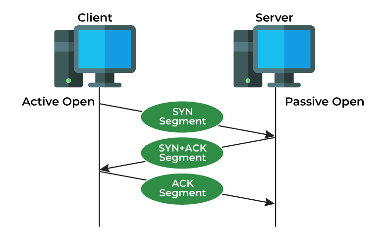
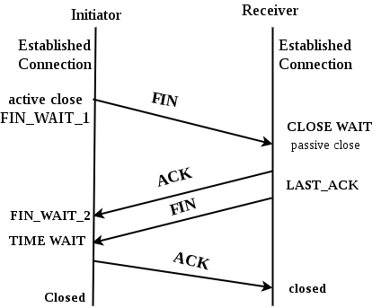
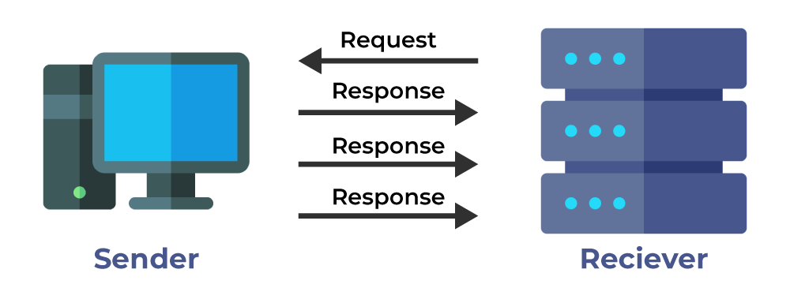
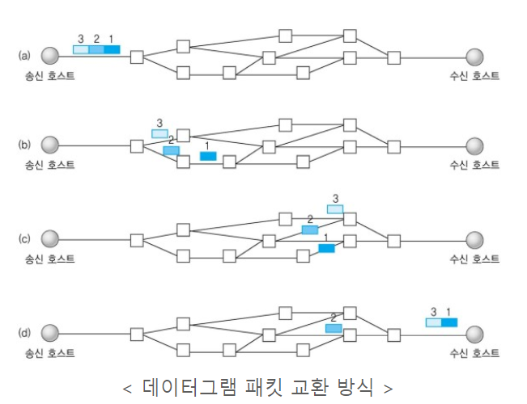
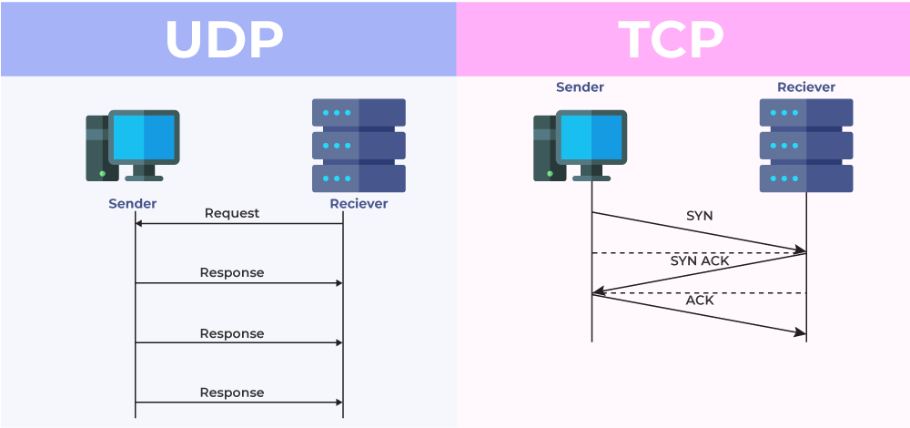

# TCP vs UDP

- TCP와 UDP는 전송 계층(Transport)에서 사용되는 프로토콜이다. 

### TCP와 UDP의 탄생 배경

- 전송 계층 전 단계에서 논리주소인 IP 주소를 기반으로 장치에서 장치로의 데이터 전송이 발생하게 된다. 즉, 하나의 장비에서 다른 하나의 장비로 데이터 전달이 일어나게 된다.
- 이때, IP 프로토콜의 경우 데이터 전송 상태에 대해서는 관리가 이뤄지지 않는다.
- 때문에 만약 통신 과정 중 IP에서 오류가 발생했을 경우 _ICMP_ 가 이를 알아차리고, 오류를 알리는 기능을 한다.

    > ICMP (_Internet Control Message Protocol_)   IP 패킷 전송 중 에러 발생 시 에러 발생 원인을 알려주거나 네트워크 상태를 진단해주는 기능을 제공하는 프로토콜

- __하지만 ICMP는 오류 상황을 알려주기만 할 뿐 대처를 하지는 못한다. 이를 보완하기 위해 IP보다 상위 계층에서 대처까지 해주는 프로토콜, UDP와 TCP가 나오게 되었다.__ 😎

### TCP (Transmission Control Protocol)

📌 __키워드 : 안정적, 순서대로, 에러 없이__ 

- 연결 지향적 프로토콜, 즉, 클라이언트와 서버가 연결된 상태에서 데이터를 주고 받는 프로토콜이다.

__TCP의 특징__

- 연결형 서비스로 가상 회선 방식을 제공한다.
    - 3-way 핸드쉐이크 과정을 통해 연결을 설정하고, 4-way 핸드쉐이크 과정을 통해 연결을 해제한다.
- 흐름 제어(Flow Control)
    - 데이터 처리 속도를 조절해 수신자의 버퍼 오버플로우를 방지한다. 송신측이 수신측보다 전송 속도가 빠르면 수신자가 받을 수 있는 용량을 넘어갈 수 있기 때문에, 이를 방지하기 위해 흐름 제어를 한다.
    - Stop and Wait, Sliding Window(Go Back N ARQ)이 대표적인 방법이다.
- 혼잡 제어(Congestion Control)
    - 네트워크 내의 패킷 수가 과도하게 증가하지 않도록 방지한다.
    - AIMD, Slow Start, Fast Retransmit, Fast Recovery 방식으로 제어를 할 수 있다.

- 큰 데이터를 패킷(packet) 단위로 나눠 전송을 하게 되며, 전송 과정에서 패킷들이 도착하는 _순서가 보장된다._ 
- 패킷들이 모두 무사히 도착을 했는지 확인을 해줘 _신뢰성이 높은 프로토콜이다._
- 대신 _속도가 느리다는 단점이 있다._

#### TCP의 연결 및 연결 해제 과정

__1. TCP 연결 과정(3-way 핸드쉐이크)__

> 요약 :   1) 클라이언트 > 서버 : `나랑 연결하자!`   2) 서버 > 클라이언트 : `그래! 내 말 잘 들리니?`   3) 클라이언트 > 서버 : `응 완전 잘 들려!`

1. SYN 단계 : 클라이언트가 서버에 클라이언트의 ISN을 담아 SYN을 보낸다. 이때 클라이언트는 `SYN_SENT` 상태로 대기한다.
2. SYN + ACK 단계 : 서버는 클라이언트가 보낸 SYN을 수신하고 서버의 ISN을 보내 승인번호로 클라이언트의 (ISN+1) 값을 보낸다. 서버는 이 단계에서 `SYN_RECEIVED` 상태로 바뀐다.
3. ACK 단계: 클라이언트는 서버에게서 받은 ISN을 활용해 ACK으로 (ISN+1) 값을 서버에게 보낸다. 이떄 클라이언트는 `ESTABLISHED` 로 변경이 되고, 이 후 클라이언트의 ACK을 받은 서버도 `ESTABLISHED` 상태로 변한다.

    > SYN (_Synchronize Sequence Number_)   연결을 시작하고 설정하는 데 사용이 되는 무작위 값

    > ACK (_Acknowledgement_)   호스트가 상대가 전달해준 SYN을 잘 받았다고 응답해주는 것

    > ISN(_Initial Sequence Number_)   초기 네트워크 연결 시 할당되는 32비트 고유 시퀀스 번호

__2. TCP 연결 해제 과정(4-way 핸드쉐이크)__

1. 클라이언트가 연결을 닫고 싶을 때 FIN(Finish, 세션을 종료시킬 때 활용이 되고 더 이상 보낸 데이터가 없음을 알림)으로 설정된 세그먼트를 서버에게 보낸다. 이때, 클라이언트는 `FIN_WAIT_1` 상태로 들어가서 서버 응답을 기다린다.

2. 클라이언트의 연결 해제 요청을 받은 서버는 클라이언트에게 ACK 승인 세그먼트를 보낸다. 이때, 서버는 `CLOSE_WAIT` 상태로 들어가며, 서버의 ACK을 받은 클라이언트는 `FIN_WAIT_2` 상태로 변한다.

3. 서버는 ACK를 보내고 일정 시간 후 클라이언트에게 FIN 세그먼트를 보낸다.

4. 서버의 FIN 세그먼트를 받은 클라이언트는 `TIME_WAIT` 상태가 되고 다시 서버로 ACK를 보낸다. 이후 서버는 `CLOSED` 상태가 됨. 나중에 _일정 시간이 지난 후_ 연결을 닫고(CLOSED) 클라이언트와 서버의 모든 자원 연결은 해제가 된다.

> ❓ 왜 `TIME_WAIT`로 있다가 시간이 지나고 `CLOSED`로 연결을 닫았을까?  

    1) 지연 패킷을 발생하는 경우를 대비하고  
    2) 두 장치의 연결이 닫혔는지 확인하기 위해서이다

> FIN(_Finish_)   세션을 종료시킬 때 활용이 되며 더 이상 보낼 데이터가 없을 알리는 시그널

### UDP(User Datagram Protocol)

📌 __키워드 : 빠르고, 간단하게, 신뢰성은 낮게__ 

- 비연결형 프로토콜, 즉 TCP와 다르게 할당되는 논리적인 경로가 없다. 그냥 요청이 발생하면 바로바로 보내주는 방식!
- 패킷 사이의 _순서를 보장하지도 않고_, 수신 여부도 확인하지 않아 _신뢰성이 없다._
- 하지만 TCP보다 _속도가 빠르고 간단하다는 장점이 있다._
- 데이터를 데이터그램 단위로 처리하는 프로토콜이다.

  
데이터그램 패킷들이 알아서 잘 따로따로 가는 것을 볼 수 있다.

### TCP vs UDP 비교✨

| **프로토콜** | **TCP** | **UDP** |
| --- | --- | --- |
| **연결 방식** | 연결형 서비스 | 비연결형 서비스 |
| **패킷 교환 방식** | 가상 회선 방식 | 데이터그램 방식 |
| **전송 순서** | 보장 | 보장 X |
| **수신 여부 확인**  | 확인함 | 확인하지 X |
| **통신 방식**  | 1:1 통신 | 1:1 OR 1:N OR N:N 통신 |
| **신뢰성** | 높음 | 낮음 |
| **전송 데이터 단위** | 패킷 | 데이터그램 패킷 |
| **속도** | 느림 | 빠름 |