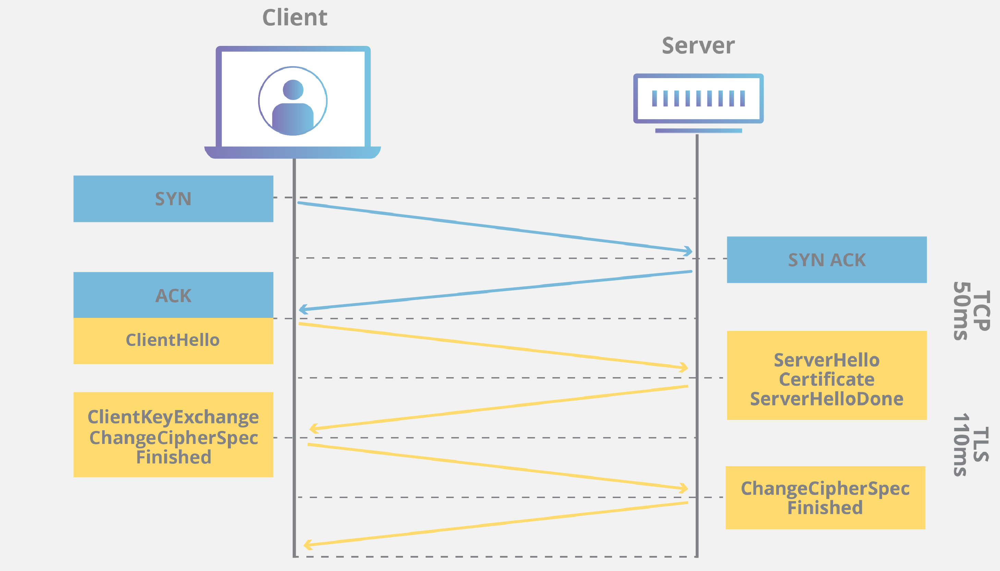

# HTTP & HTTPS

## 1. HTTP(HyperText Transfer Protocol)

HTTP는 응용 계층에서 웹 서비스 통신에 사용이 된다. 클라리언트와 서버가 자원을 주고 받을 때 쓰는 통신 프로토콜이다. 

하지만 HTTP의 경우 텍스트 교환이므로, 누군가 네트워크에서 신호를 가로채면 내용이 노출되는 보안 이슈가 존재한다.

이 때문에 보안 기능을 덧붙인 프로토콜인 HTTPS가 등장하게 되었다.

## 2. HTTPS(HyperText Transfer Protocol Secure)

인터넷 상에서 정보를 암호화하는 SSL/TLS 프로토콜을 사용해 클라이언트와 서버가 자원을 주고 받을 때 쓰는 프로토콜이다. 
응용 계층과 전송 계층 사이에 신뢰 계층인 SSL/TLS가 들어가 신뢰할 수 있는 HTTP 요청을 처리해준다.

이를 통해 _통신을 암호화할 수 있다._

### SSL(Secure Sockets Layer)/TLS(Transport Layer Security)

- 보안을 제공하는 프로토콜
- 클라이언트와 서버 통신 시 제 3자가 메시지를 도청하거나 변조하지 못하도록 한다. 즉, _공격자가 서버인 척을 하며 사용자 정보를 가로채는_ __인터셉터 문제__ 를 방지할 수 있다.
- TLS는 SSL의 향상된, 더욱 안전한 버전이다.
- SSL은 CA(Certificate Authority)에서 발급 받을 수 있다.

### HTTPS 통신 흐름

0. 그림 상에서 파란 부분이 실행이 된다. HTTPS의 경우 TCP 기반 프로토콜이기 때문에 우선 3-way 핸드쉐이크로 클라이언트와 서버 간 연결이 이뤄진다.

1. Client Hello
    - 클라이언트가 서버에게 `Hello` 메시지를 전송하며 핸드쉐이크를 시작한다. 
    - 클라이언트는 SSL/TLS의 버전, cipher suite, 그리고 무작위 바이트 문자열이 포함된다.

2. Server Hello
    - 클라이언트의 인사에 서버가 응답한다.
    - 서버는 서버의 SSL/TLS, 서버의 cipher suite, 무작위 바이트 문자열을 클라이언트에게 보낸다.

3. 인증(Authentication, Certificate)
    - 클라이언트가 서버의 SSL/TLS 인증서를 CA를 통해 검증한다.  
    - 이를 통해 서버가 인증서에 명시된 서버인지, 그리고 클라이언트가 상호작용 중인 서버가 실제 해당 도메인의 소유자인지 확인한다.

4. 서버 키 교환(Server Key Exchange, ServerHello Done)
    - 서버의 공개 키가 SSL/TLS 인증서 내부에 없는 경우, 서버가 직접 전달한다. 공개 키가 SSL/TLS 인증서 내부에 있을 경우 이 단계는 생략이 된다.
    - 인증서 내부에 서버의 공개 키가 있다면, 클라이언트가 CA의 공개 키를 통해 인증서를 복호화한 후 서버의 공개 키를 확보한다. 그리고 서버가 행동을 마쳤음을 전달한다.

5. 클라이언트 키 교환(Client Key Exchange)
    - 클라이언트는 데이터 암호화에 사용할 대칭 키를 생성한 후 SSL 인증서 내부에서 추출한 서버의 공개키를 이용해 암호화한 후 서버에게 전달한다.
    - __여기서 전달된 대칭 키가 SSL/TSL 핸드쉐이크의 목적이며, 데이터를 실제로 암호화할 대칭 키이다.__
    - 이제 이 키를 통해 클라이언트와 서버가 실제로 교환하려는 데이터를 암호화한다.

6. ChangeCipherSpec, Finished
    - `ChangeCipherSpec` 패킷은 클라이언트와 서버 모두가 서로에게 보내는 패킷이다. 이 패킷은 교환할 정보를 모두 교환한 뒤 통신할 준비가 다 되었음을 알리는 패킷이다.
    - 이 후 `Finished` 패킷을 보내 SSL/TLS 핸드쉐이크를 마무리한다.

Reference: 
[링크1](https://steady-coding.tistory.com/512)  
[링크2](https://www.ibm.com/docs/en/ibm-mq/9.3?topic=tls-overview-ssltls-handshake)
